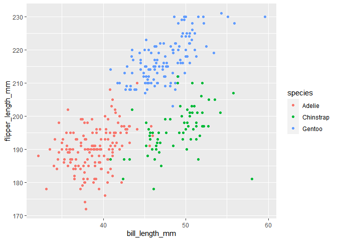

Homework 1
================
Matthew Angulo

This is my solution to HW1

``` r
library(tidyverse)
```

    ## -- Attaching packages --------------------------------------------------------------------------------- tidyverse 1.3.0 --

    ## v ggplot2 3.3.2     v purrr   0.3.4
    ## v tibble  3.0.3     v dplyr   1.0.2
    ## v tidyr   1.1.2     v stringr 1.4.0
    ## v readr   1.3.1     v forcats 0.5.0

    ## -- Conflicts ------------------------------------------------------------------------------------ tidyverse_conflicts() --
    ## x dplyr::filter() masks stats::filter()
    ## x dplyr::lag()    masks stats::lag()

## Problem 1

Create a data frame with the specified elements.

``` r
prob1_df = 
  tibble(
    samp = rnorm(10),
    samp_gt_0 = samp > 0,
    char_vec = c("a", "b", "c", "d", "e", "f", "g", "h", "i", "j"),
    factor_vec = factor(c("low","low","low","med", "med", "med", "med", "high", "high", "high"))
  )

prob1_df
```

    ## # A tibble: 10 x 4
    ##       samp samp_gt_0 char_vec factor_vec
    ##      <dbl> <lgl>     <chr>    <fct>     
    ##  1 -1.37   FALSE     a        low       
    ##  2  1.47   TRUE      b        low       
    ##  3 -0.514  FALSE     c        low       
    ##  4  0.222  TRUE      d        med       
    ##  5  1.53   TRUE      e        med       
    ##  6  1.79   TRUE      f        med       
    ##  7 -0.342  FALSE     g        med       
    ##  8 -0.183  FALSE     h        high      
    ##  9  0.0534 TRUE      i        high      
    ## 10  0.217  TRUE      j        high

Take the mean of each variable in my data frame

``` r
mean(pull(prob1_df, samp))
```

    ## [1] 0.2881547

``` r
mean(pull(prob1_df, samp_gt_0))
```

    ## [1] 0.6

``` r
mean(pull(prob1_df, char_vec))
```

    ## Warning in mean.default(pull(prob1_df, char_vec)): argument is not numeric or
    ## logical: returning NA

    ## [1] NA

``` r
mean(pull(prob1_df, factor_vec))
```

    ## Warning in mean.default(pull(prob1_df, factor_vec)): argument is not numeric or
    ## logical: returning NA

    ## [1] NA

I can take the mean of numbers and logical but not character or factor.

Now converting variables to numeric.

``` r
as.numeric(pull(prob1_df, samp))
as.numeric(pull(prob1_df, samp_gt_0))
as.numeric(pull(prob1_df, char_vec))
```

    ## Warning: NAs introduced by coercion

``` r
as.numeric(pull(prob1_df, factor_vec))
```

Character variables cannot be converted to numeric.

Now, converting the logical variable into numeric or factor and then
multiplying it by the random sample

``` r
as.numeric(pull(prob1_df, samp_gt_0))*pull(prob1_df, samp)
```

    ##  [1] 0.00000000 1.47398217 0.00000000 0.22237185 1.53299908 1.79461844
    ##  [7] 0.00000000 0.00000000 0.05343647 0.21655768

``` r
as.factor(pull(prob1_df, samp_gt_0))*pull(prob1_df, samp)
```

    ## Warning in Ops.factor(as.factor(pull(prob1_df, samp_gt_0)), pull(prob1_df, : '*'
    ## not meaningful for factors

    ##  [1] NA NA NA NA NA NA NA NA NA NA

``` r
as.numeric(as.factor(pull(prob1_df, samp_gt_0)))*pull(prob1_df, samp)
```

    ##  [1] -1.3745097  2.9479643 -0.5136074  0.4447437  3.0659982  3.5892369
    ##  [7] -0.3416132 -0.1826882  0.1068729  0.4331154

Factors of logical variables cannot be multiplied by numbers

## Problem 2

``` r
data("penguins", package = "palmerpenguins")
penguins
```

    ## # A tibble: 344 x 8
    ##    species island bill_length_mm bill_depth_mm flipper_length_~ body_mass_g
    ##    <fct>   <fct>           <dbl>         <dbl>            <int>       <int>
    ##  1 Adelie  Torge~           39.1          18.7              181        3750
    ##  2 Adelie  Torge~           39.5          17.4              186        3800
    ##  3 Adelie  Torge~           40.3          18                195        3250
    ##  4 Adelie  Torge~           NA            NA                 NA          NA
    ##  5 Adelie  Torge~           36.7          19.3              193        3450
    ##  6 Adelie  Torge~           39.3          20.6              190        3650
    ##  7 Adelie  Torge~           38.9          17.8              181        3625
    ##  8 Adelie  Torge~           39.2          19.6              195        4675
    ##  9 Adelie  Torge~           34.1          18.1              193        3475
    ## 10 Adelie  Torge~           42            20.2              190        4250
    ## # ... with 334 more rows, and 2 more variables: sex <fct>, year <int>

The Penguins dataset is a summary of information on penguins. The
dataset has 344 variables and 8 observations. The included variables
are: species, island, bill\_length\_mm, bill\_depth\_mm,
flipper\_length\_mm, body\_mass\_g, sex, year.

The mean flipper length (rounded to the nearest mm) of penguins with
nonmissing values in this dataset is 201 mm

Below is a scatterplot comparing flipper length to bill length, color
coated by species.

``` r
ggplot(penguins, aes(x = bill_length_mm, y = flipper_length_mm, color = species))+geom_point()
```

    ## Warning: Removed 2 rows containing missing values (geom_point).

<!-- -->

``` r
ggsave(
  "p8105_hw1_ma3997.pdf")
```

    ## Saving 7 x 5 in image

    ## Warning: Removed 2 rows containing missing values (geom_point).
